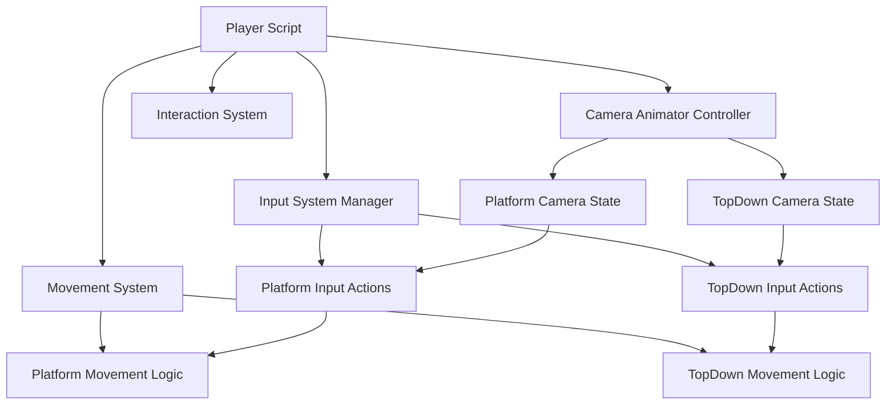

# Design Document

## Overview

Este documento describe el diseño técnico para implementar un sistema de control de jugador dinámico que integre el New Input System de Unity con un sistema de cámaras intercambiables. El sistema permitirá cambiar entre dos modos de cámara (Platform y TopDown) con esquemas de control específicos para cada modo.

## Architecture

### Componentes Principales

1. **Player Controller Script**: Script principal que maneja toda la lógica de movimiento, salto, interacción y cambio de cámaras
2. **Input Action Assets**: Archivos de configuración de entrada ya existentes (Plataform.inputactions y TopDown.inputactions)
3. **Camera System**: Sistema de cámaras con Animator Controller para transiciones
4. **State Management**: Sistema para rastrear el estado actual de la cámara

### Diagrama de Arquitectura



## Components and Interfaces

### Player Controller Class

```csharp
public class Player : MonoBehaviour
{
    // Input System Components
    private PlayerInput playerInput;
    private InputActionMap currentActionMap;
    
    // Camera System
    private Animator cameraAnimator;
    private bool isPlatformMode = true;
    
    // Movement Components
    private CharacterController characterController;
    private Rigidbody playerRigidbody;
    
    // Movement Parameters
    [SerializeField] private float moveSpeed = 5f;
    [SerializeField] private float jumpForce = 10f;
    [SerializeField] private LayerMask groundLayer;
    
    // Ground Detection
    private bool isGrounded;
    private Transform groundCheck;
    
    // Input Actions
    private InputAction moveAction;
    private InputAction jumpAction;
    private InputAction interactAction;
    private InputAction changeViewAction;
}
```

### Input Action Maps

**Platform Mode Actions:**
- Forward/Backward/Left/Right: Movimiento 3D relativo a la cámara
- Jump: Salto vertical
- Interact: Interacción con objetos
- ChangeView: Cambio a modo TopDown

**TopDown Mode Actions:**
- Forward/Backward/Left/Right: Movimiento 2D en plano horizontal
- Interact: Interacción con objetos
- ChangeView: Cambio a modo Platform

### Camera State Detection

El sistema detectará el estado actual de la cámara mediante:
1. **Animator State Info**: Verificación del estado actual del Animator Controller
2. **State Tracking**: Variable booleana para rastrear el modo actual
3. **Event-Based Updates**: Callbacks cuando cambia el estado de la cámara

## Data Models

### Movement Data Structure

```csharp
[System.Serializable]
public struct MovementSettings
{
    public float moveSpeed;
    public float acceleration;
    public float deceleration;
    public bool allowVerticalMovement;
}

[System.Serializable]
public struct PlatformSettings : MovementSettings
{
    public float jumpForce;
    public float gravity;
    public LayerMask groundLayer;
}

[System.Serializable]
public struct TopDownSettings : MovementSettings
{
    // Configuraciones específicas para vista superior
    public bool lockYAxis;
}
```

### Input State Management

```csharp
public enum CameraMode
{
    Platform,
    TopDown
}

public class InputStateManager
{
    public CameraMode currentMode { get; private set; }
    public InputActionAsset platformActions;
    public InputActionAsset topDownActions;
    
    public void SwitchMode(CameraMode newMode);
    public InputActionMap GetCurrentActionMap();
}
```

## Error Handling

### Input System Validation

1. **Missing Input Actions**: Verificar que los archivos de Input Actions estén asignados
2. **Action Map Validation**: Confirmar que las acciones requeridas existen en cada mapa
3. **Device Compatibility**: Manejar diferentes tipos de dispositivos de entrada

### Camera System Validation

1. **Animator Controller Validation**: Verificar que el Animator Controller tenga los estados y triggers requeridos
2. **Camera State Synchronization**: Asegurar que el estado del script coincida con el estado del Animator
3. **Transition Handling**: Manejar transiciones de cámara incompletas o interrumpidas

### Movement System Error Handling

1. **Ground Detection Failures**: Fallback cuando la detección de suelo falla
2. **Physics Component Validation**: Verificar que CharacterController o Rigidbody estén presentes
3. **Boundary Checking**: Prevenir movimiento fuera de límites válidos

### Error Recovery Strategies

```csharp
public class ErrorHandler
{
    public static void HandleInputSystemError(string errorMessage)
    {
        Debug.LogError($"Input System Error: {errorMessage}");
        // Fallback a controles básicos
    }
    
    public static void HandleCameraTransitionError()
    {
        Debug.LogWarning("Camera transition failed, reverting to previous state");
        // Revertir al estado anterior de cámara
    }
    
    public static void HandleMovementError(Exception e)
    {
        Debug.LogError($"Movement Error: {e.Message}");
        // Detener movimiento y resetear estado
    }
}
```

## Testing Strategy

### Unit Tests

1. **Input Action Mapping Tests**
   - Verificar que las acciones se mapeen correctamente según el modo de cámara
   - Probar cambios entre modos de entrada
   - Validar que las acciones inactivas no respondan

2. **Movement Logic Tests**
   - Probar movimiento en modo Platform vs TopDown
   - Verificar que el salto solo funcione en modo Platform
   - Probar detección de suelo y física de salto

3. **Camera State Management Tests**
   - Probar detección correcta del estado de cámara
   - Verificar sincronización entre script y Animator
   - Probar transiciones de estado

### Integration Tests

1. **Input-to-Movement Pipeline**
   - Probar flujo completo desde entrada hasta movimiento
   - Verificar que diferentes dispositivos de entrada funcionen
   - Probar combinaciones de acciones simultáneas

2. **Camera-Input Synchronization**
   - Probar que el cambio de cámara active el Input Action Map correcto
   - Verificar que las transiciones sean fluidas
   - Probar casos edge durante transiciones

### Performance Tests

1. **Input Processing Performance**
   - Medir latencia de procesamiento de entrada
   - Probar rendimiento con múltiples acciones simultáneas
   - Verificar que no haya memory leaks en cambios de modo

2. **Movement Performance**
   - Probar rendimiento de detección de suelo
   - Medir impacto de cálculos de movimiento
   - Verificar smooth framerate durante movimiento

### Manual Testing Scenarios

1. **Gameplay Flow Testing**
   - Probar experiencia completa de cambio entre modos
   - Verificar que los controles se sientan intuitivos
   - Probar interacción con objetos en ambos modos

2. **Edge Case Testing**
   - Probar cambio de cámara durante salto
   - Verificar comportamiento durante interacciones
   - Probar múltiples cambios rápidos de cámara

3. **Device Compatibility Testing**
   - Probar con teclado y mouse
   - Probar con gamepad
   - Verificar que los controles sean consistentes

### Test Data and Scenarios

```csharp
public static class TestScenarios
{
    public static readonly Vector2[] MovementInputs = {
        Vector2.up,      // Forward
        Vector2.down,    // Backward  
        Vector2.left,    // Left
        Vector2.right,   // Right
        Vector2.zero     // No input
    };
    
    public static readonly CameraMode[] CameraModes = {
        CameraMode.Platform,
        CameraMode.TopDown
    };
    
    public static readonly string[] RequiredAnimatorTriggers = {
        "Platform",
        "TD"
    };
}
```

## Implementation Notes

### Performance Considerations

1. **Input Polling**: Usar event-based input en lugar de polling continuo
2. **State Caching**: Cachear el estado de cámara para evitar consultas frecuentes al Animator
3. **Action Map Switching**: Minimizar la frecuencia de cambios de Action Map

### Unity-Specific Considerations

1. **Input System Package**: Asegurar que el paquete Input System esté instalado y configurado
2. **Player Input Component**: Usar PlayerInput component para manejo automático de dispositivos
3. **Action Asset References**: Usar referencias directas a los assets en lugar de strings

### Extensibility

El diseño permite futuras extensiones:
1. **Nuevos Modos de Cámara**: Fácil adición de nuevos modos con sus propios Input Action Maps
2. **Configuraciones Personalizables**: Settings scriptables para diferentes configuraciones de movimiento
3. **Event System**: Sistema de eventos para notificar cambios de estado a otros sistemas